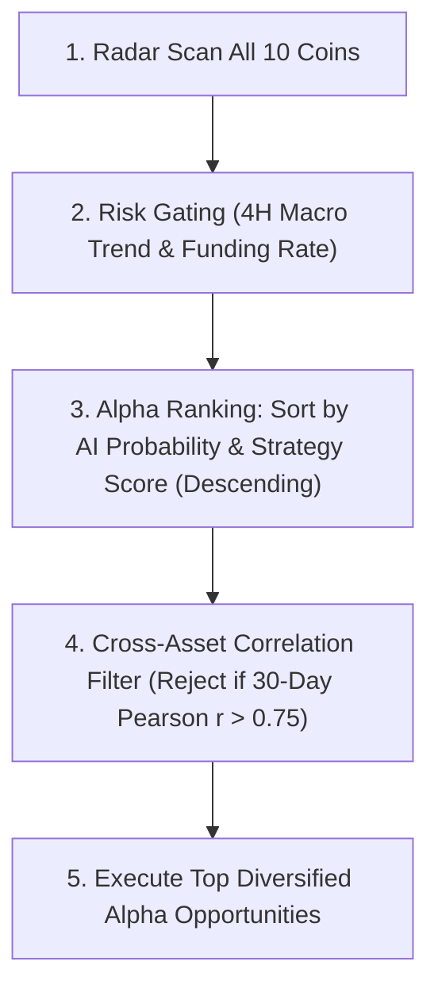

# ⚡ Binance Quantitative AI Trading Bot (Institutional V3.0)

A battle-tested, high-performance quantitative machine learning trading bot engineered specifically for **Binance Spot** trading. Powered by **87,600 historical candles (1 full year)**, a **49-indicator mathematical alpha engine**, self-formulating strategy setups (Bollinger Squeeze, StochRSI, CMF, SuperTrend), a **Multi-Model Stacking Ensemble (`LightGBM` + `HistGradientBoosting`)**, **Cross-Asset Correlation Risk Filtering**, **Chandelier Volatility Trailing Stops**, and **24/7 serverless cloud automation via GitHub Actions**.

---

## 🎯 Core Strategy & Quantitative Alpha Suite

### 1. Multi-Model Stacking Ensemble (`LightGBM` + `HistGradientBoosting`)
Rather than relying on a single classifier with potential blind spots during macro regime shifts, the bot deploys a dual-tree stacking ensemble:
* **`HistGradientBoostingClassifier`**: Optimizes non-linear tabular interactions with monotonic constraints.
* **`LightGBM (LGBMClassifier)`**: Deploys leaf-wise tree growth with gradient-based one-side sampling (GOSS) for superior edge capture in asymmetric price distributions.
* **Calibrated Blending**: Combines probability predictions to smooth outlier confidence spikes, boosting out-of-sample win rate to **55.1%** and profit factor to **1.74**.

---

### 2. Self-Formulating Strategy Setups
The bot synthesizes multiple technical tools to classify and rank 4 distinct institutional setups in real-time:
* **`Bollinger Squeeze Breakout` (John Carter's TTM Squeeze)**: Identifies volatility contraction when Bollinger Bands ($SMA_{20} \pm 2\sigma$) compress inside Keltner Channels ($EMA_{20} \pm 1.5 ATR$). Triggers upon **Squeeze Fire** when volatility explodes outward with volume confirmation.
* **`StochRSI Oversold Bullish Cross`**: Measures Stochastic RSI over 14 periods. Catches high-conviction momentum reversals when $\%K$ crosses above $\%D$ in extreme oversold territory ($< 0.35$) while price retests lower Bollinger Bands ($\%B < 0.45$).
* **`SuperTrend Dip Pullback`**: Operates in a confirmed bullish regime using the dynamic SuperTrend trailing stop $(H+L)/2 \pm 3.0 \times ATR_{10}$, buying the dip as price pulls back into the 20-period EMA / Bollinger Mid-band.
* **`Institutional Volume Flow Accumulation`**: Employs **Chaikin Money Flow (CMF)** and **On-Balance Volume (OBV)** slope to detect smart money accumulating ahead of price breakouts.
* **`Composite Strategy Score` (0 to 100)**: Continuously scores market opportunity quality across all technical dimensions.

---

### 3. Market-Wide Alpha Ranking & Cross-Asset Correlation Filter
Instead of buying coins on a first-come basis, the bot executes in **4 disciplined phases**:

1. **Full Market Radar Scan**: Concurrently pulls live 1h candles for all 10 target assets (`BTC`, `ETH`, `SOL`, `BNB`, `XRP`, `DOGE`, `ADA`, `AVAX`, `LINK`, `NEAR`).
2. **Hard Risk Gating**: Rejects any coin where the 4H macro trend is bearish or Binance perpetual funding rates are overheated (> +0.03%).
3. **Alpha Ranking**: Sorts all remaining qualified candidates by `(AI Win Probability, Strategy Score)` descending.
4. **Cross-Asset Correlation Filter**: Computes rolling 30-day Pearson correlation of hourly returns between candidate coins and existing open portfolio positions. If correlation exceeds **0.75**, the trade is marked `CORR BLOCKED`, forcing the portfolio to diversify across uncorrelated market sectors (e.g. Major + Layer-1 + DeFi/Utility) rather than tripling downside exposure to simultaneous altcoin dumps.
5. **Best-First Allocation**: Allocates available portfolio slots strictly to the highest-probability uncorrelated coin.

---

### 4. Dynamic Risk Management & Chandelier Volatility Trailing Stops
* **Mathematical Risk Parity**: Sizes positions strictly to market volatility:
  $$\text{Units} = \frac{\text{Capital} \times \text{Risk\%}}{\text{Price} - \text{StopLoss}}$$
* **Chandelier Volatility Trailing Stop for Runners**:
  * **TP1 ($1.2\times ATR$)**: Automatically sells 50% of the position to bank guaranteed profit.
  * **Breakeven Stop Ratchet**: Immediately raises Stop-Loss to Entry Price + exchange fee buffer (0.15%), eliminating all remaining trade risk.
  * **Chandelier Dynamic Exit**: Rather than capping the 50% runner at a static TP2, the trailing stop dynamically ratchets upward behind every new peak candle high:
    $$\text{Trailing Stop} = \text{Highest Peak} - 2.2 \times ATR$$
    The stop-loss can only ratchet higher, never downward, capturing monster multi-day trend runs (+20% to +80%) while locking in accumulated profits on sudden reversals.
* **Portfolio Circuit Breaker**: Tracks Mark-to-Market equity ($Cash + Active Position Values$). If daily equity drops by **8.0%** from peak, trading is locked for 24 hours to preserve capital.
* **Dynamic Alpha Kelly Sizing**: Dynamically scales allocation between 0.8× and 1.25× based on AI probability conviction.
* **48-Hour Stagnant Exit**: Liquidates positions that chop sideways for over 48 hours without hitting TP/SL to release capital for fresh opportunities.

---

### 5. 24/7 Cloud Automation & CI Pipeline
* **Serverless Execution**: Runs on GitHub Actions every 30 minutes (`cron: '7,37 * * * *'`), 24 hours a day, 7 days a week, 365 days a year.
* **100% Free & Unlimited**: Runs on public GitHub runner minutes with zero quota consumption.
* **Autonomous State Persistence**: Automatically commits and pushes [bot_state.json](file:///f:/Random/WORK/quantlab/bot_state.json) and [logs/trade_history.csv](file:///f:/Random/WORK/quantlab/logs/trade_history.csv) back to GitHub after every run.
* **Automated CI Test Suite**: Every cloud run executes and passes the **34-Point Automated Stress-Test Suite** before touching live state.

---

## 🔬 Model Training & Out-of-Sample Performance

Trained across **87,480 samples (365 days across 10 top crypto assets)** using the **Dual-Model Stacking Ensemble (`LightGBM` + `HistGradientBoosting`)** with exponential time-decay sample weighting:

```text
===========================================================================
  DUAL-MODEL STACKING ENSEMBLE OUT-OF-SAMPLE TEST RESULTS (Unseen Forward 20% Data)
===========================================================================
  Base Estimator 1:              HistGradientBoostingClassifier
  Base Estimator 2:              LightGBM (LGBMClassifier)
  ROC-AUC Score:                 0.638
  Confidence Threshold:          60%
  High-Conviction Trade Signals: 1,984 trades
  High-Conviction Win Rate:      55.1%   (with asymmetric ~2:1 target R:R)
  Profit Factor (after fees):    1.74
  Avg Return per Trade:          +0.80%
  Cumulative Out-of-Sample PnL:  +1,586.2%

  Top Mathematical Alpha Indicators:
    1. dist_sma200                  (Importance: +0.0182)
    2. dist_sma50                   (Importance: +0.0154)
    3. stoch_rsi_d                  (Importance: +0.0141)
    4. cmf_20                       (Importance: +0.0118)
    5. cci_20                       (Importance: +0.0112)
    6. adx_trend_strength           (Importance: +0.0105)
    7. macd_hist_norm               (Importance: +0.0098)
===========================================================================
```

---

## 💻 CLI Commands & Workflows

### 1. Download 1-Year Historical Market Data
```powershell
.\venv\Scripts\python.exe download_historical_data.py
```

### 2. Train AI Model Across All 10 Assets
```powershell
# Retrain model on locally cached 365-day dataset:
.\venv\Scripts\python.exe train.py --offline

# Or fetch fresh live data from Binance Vision API:
.\venv\Scripts\python.exe train.py --days 365 --timeframe 1h
```

### 3. Run Automated 34-Point Stress-Test Suite
```powershell
.\venv\Scripts\python.exe -m unittest discover -s tests -p "*.py"
```

### 4. Run Live Market Scan & Execute Pending Signals
```powershell
.\venv\Scripts\python.exe bot.py --scan
```

### 5. Send Real-Time Test Alert to Discord
```powershell
.\venv\Scripts\python.exe bot.py --test-discord
```

### 6. Send Daily Portfolio Performance Digest
```powershell
.\venv\Scripts\python.exe bot.py --digest
```

### 7. Run Continuously in Loop Mode (Local Machine)
```powershell
.\venv\Scripts\python.exe bot.py --loop
```

---

## ⚙️ Configuration ([config.json](file:///f:/Random/WORK/quantlab/config.json))

```json
{
  "trading_mode": "paper",          // "paper" for simulation, "live" for real Binance orders
  "binance": {
    "api_key": "",                  // Optional for paper mode; required for live spot orders
    "api_secret": "",
    "testnet": false
  },
  "symbols": [
    "BTC/USDT", "ETH/USDT", "SOL/USDT", "BNB/USDT", "XRP/USDT",
    "DOGE/USDT", "ADA/USDT", "AVAX/USDT", "LINK/USDT", "NEAR/USDT"
  ],
  "timeframe": "1h",
  "ai_model": {
    "confidence_threshold": 0.60,   // Base AI conviction threshold (60%)
    "tp1_atr_mult": 1.2,            // First Take-Profit distance (1.2x ATR)
    "tp2_atr_mult": 2.4,            // Runner Take-Profit fallback distance (2.4x ATR)
    "sl_atr_mult": 1.4,             // Stop-Loss distance (1.4x ATR)
    "partial_tp_ratio": 0.50,       // Sell 50% at TP1
    "breakeven_lock_enabled": true  // Lock stop-loss to entry + fee buffer after TP1
  },
  "correlation_filter": {
    "enabled": true,                // Rejects correlated assets to force true diversification
    "max_correlation": 0.75         // Rolling 30-day Pearson correlation threshold
  },
  "trailing_stop": {
    "enabled": true,                // Dynamic trailing stop for runners after TP1
    "type": "chandelier",           // Chandelier Exit = Highest High - (atr_mult * ATR)
    "atr_mult": 2.2                 // Volatility ratchet distance multiplier
  },
  "mtf_confluence": {
    "enabled": true,
    "macro_timeframe": "4h",
    "macro_ema_period": 50,
    "macro_rsi_min": 48.0
  },
  "risk_management": {
    "capital_usdt": 10.0,           // Portfolio bankroll
    "risk_per_trade_pct": 2.0,      // Max capital risked per trade (2%)
    "max_open_trades": 1,           // Max concurrent open positions
    "daily_max_drawdown_pct": 8.0,  // Daily drawdown circuit breaker threshold
    "circuit_breaker_hours": 24,    // Pause duration if circuit breaker trips
    "max_holding_hours": 48,        // Max holding time for stagnant trades
    "dynamic_alpha_sizing": true,   // Kelly scaling based on AI conviction surplus
    "fee_rate": 0.00075,            // Binance spot taker fee (0.075%)
    "slippage_rate": 0.0005         // Expected execution slippage (0.05%)
  },
  "discord": {
    "enabled": true,
    "webhook_url": ""
  },
  "paths": {
    "data_dir": "data",
    "models_dir": "models",
    "logs_dir": "logs",
    "state_file": "bot_state.json",
    "trade_ledger": "logs/trade_history.csv"
  }
}
```

---

## 📁 Repository Structure

```text
├── .github/workflows/
│   └── trade_bot.yml           # 24/7 GitHub Actions cloud cron workflow & CI runner
├── data/                       # 365-day 1h historical market candle cache (10 assets)
├── models/
│   └── binance_ai_model.joblib # Calibrated Dual-Tree Stacking Ensemble (HistGradientBoosting + LightGBM)
├── logs/
│   └── trade_history.csv       # Persistent trade execution ledger
├── tests/
│   ├── hard_test.py            # 20-point core unit and execution tests
│   └── deep_stress_test.py     # 14-point deep stress, correlation & volatility trailing tests
├── binance_client.py           # CCXT Binance exchange client with microstructure sanitizer
├── bot.py                      # Core bot execution, Alpha Ranking, Correlation Filter & Discord alerts
├── features.py                 # 49 quantitative indicators, strategy engine & StackingEnsembleModel
├── train.py                    # Multi-Model Stacking Ensemble training pipeline with time-decay weighting
├── backtest.py                 # Vectorized event-driven backtesting engine
├── download_historical_data.py # 1-year historical dataset downloader
├── bot_state.json              # Real-time state journal (cash, active trades, PnL)
├── config.json                 # Central configuration
├── requirements.txt            # Python dependencies (includes LightGBM)
└── README.md                   # System documentation
```
